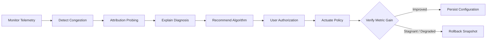

# SariChesko

> **Etymology:** Derived from the Telugu phrase *సరిచేస్కో (Sari-chesko)*, signifying *"To resolve, rectify, or sort out."*

[](https://www.python.org/)
[](https://www.qt.io/)
[](https://github.com/)
[](https://www.nsnam.org/)
[](LICENSE)

An open-source, cross-platform systems utility and network instrumentation testbed engineered for **real-time network congestion detection, multi-hop fault attribution, and automated traffic mitigation**. SariChesko bridges empirical transport-layer telemetry with classical traffic shaping and Active Queue Management (AQM) algorithms to provide observable, deterministic endpoint quality-of-service.

---

## Abstract & System Overview

Network degradation frequently suffers from ambiguous fault localization: end users cannot readily distinguish between local host bufferbloat, local area network (LAN) saturation, last-mile physical link degradation, and upstream transit provider outages. Consequently, applying host-level traffic control indiscriminately can be futile or counterproductive.

**SariChesko** addresses this challenge through a closed-loop diagnostic and mitigation pipeline:
1. **Telemetry & Baselines:** Continuously samples physical interface metrics and establishes dynamic empirical baselines.
2. **Multi-Target Fault Attribution:** Dispatches sequential probes across the network hierarchy (loopback $\to$ LAN gateway $\to$ ISP edge $\to$ transit WAN $\to$ DNS $\to$ CDN) to classify whether bottlenecks are edge-local or upstream.
3. **Deterministic Heuristic Selection:** Recommends optimal algorithmic remedies (Leaky Bucket, Token Bucket, RED, or CoDel) based on observable queue characteristics.
4. **Human-in-the-Loop Safe Actuation:** Executes operating-system-level traffic control (via Linux `iproute2`/`tc` or Windows PowerShell `NetQosPolicy`) exclusively upon explicit user authorization.
5. **Empirical Verification & Automatic Rollback:** Measures post-intervention link performance against pre-intervention state, offering deterministic one-click rollback if link quality fails to improve.



---

## Dual Operational Paradigms

To support both live system management and reproducible empirical experimentation, SariChesko provides two decoupled operational modes:

### Paradigm A: Live Production Network Telemetry
* **Interface Auto-Discovery:** Enumerates network interfaces via platform-native socket APIs and `psutil`.
* **Dynamic Baselining:** Derives statistically normalized baselines for latency, throughput, and packet-drop rates under resting conditions versus loaded states.
* **Anomaly Detection:** Flags deviations from established statistical baselines using composite scoring.
* **Kernel-Level Policy Enforcement:** Modifies queuing disciplines (`qdisc`) on Linux or PowerShell `NetQosPolicy` filters on Windows.
* **Snapshot & Verification:** Enforces an empirical post-actuation validation cycle (re-measuring link conditions via a ~5-second diagnostic pass) with automated state recovery upon regression.

### Paradigm B: Discrete-Event Simulation Laboratory
* **Controlled Evaluation Sandbox:** Provides an isolated testbed to analyze algorithm dynamics without destabilizing host networking.
* **Simulation Engine Architecture:** Powered by a pure-Python discrete-event simulation engine (`python_sim.py`), with the architecture designed to support an optional **ns-3** (Network Simulator 3) subprocess bridge as a planned advanced backend.
* **Comparative Benchmark Matrix:** Evaluates all four queue-management disciplines concurrently against identical synthetic packet injection profiles (bursty distributions, Pareto transfers, continuous bulk TCP flows).
* **Architectural Isolation:** Strict boundary enforcement ensures zero simulation execution pathways interface with system-level traffic control controllers.

---

## Algorithmic Framework

SariChesko incorporates four foundational congestion-management mechanisms spanning **Traffic Shaping** (rate regulation) and **Active Queue Management** (bufferbloat mitigation):

| Algorithm | Taxonomic Class | Operational Principle | Primary Efficacy Regime |
| :--- | :--- | :--- | :--- |
| **Leaky Bucket** | Traffic Shaping | Queues inbound bursts and discharges packets at a strict, constant egress rate ($\rho$). | Eliminating egress jitter; enforcing deterministic downstream bitrates. |
| **Token Bucket** | Traffic Shaping | Accumulates transmission tokens at rate $r$ up to capacity $b$; permits bounded bursts of length $\le b$. | Accommodating burst-tolerant workflows while bounding sustained utilization. |
| **Random Early Detection (RED)** | Active Queue Management | Computes exponential weighted moving average queue length ($avg$); drops packets probabilistically between thresholds $[min_{th}, max_{th}]$. | Preventing global TCP synchronization and buffer saturation in intermediate buffers. |
| **Controlled Delay (CoDel)** | Active Queue Management | Tracks packet sojourn time (dwell duration in queue); triggers early drops only when minimum delay exceeds `target` over an `interval`. | Combating bufferbloat in variable-bandwidth links without manual buffer tuning. |

> [!NOTE]
> No single queuing discipline is universally optimal. Network topology, path symmetry, and workload burstiness determine algorithm efficacy. SariChesko evaluates empirical telemetry before issuing a tailored recommendation.

---

## Multi-Hop Fault Attribution & ISP Outage Detection

To prevent erroneous local configuration changes during upstream failures, SariChesko executes a tiered probing sequence across progressive hops:

```text
[Host Interface]
       │
       ▼ Level 0: Loopback Interrogation (Socket / Stack Sanity)
[Default Gateway]
       │
       ▼ Level 1: Local Access Point / LAN Router Interface
[First-Hop ISP PoP]
       │
       ▼ Level 2: Point of Presence / First Public Hop (ICMP Trace)
[Upstream WAN Transit]
       │
       ▼ Level 3: Tier-1 Anycast Targets (e.g., 8.8.8.8, 1.1.1.1)
[DNS Resolution Subsystem]
       │
       ▼ Level 4: Recursive Resolver Query & Latency Validation
[Application Layer CDN]
       ▼ Level 5: Edge Content Delivery Network Endpoint
```

### Diagnostic Decision Matrix

Empirical probe responses are evaluated against a deterministic fault matrix:

| Probe State Vector | Diagnostic Classification | Recommended Action |
| :--- | :--- | :--- |
| `Gateway Unreachable` | **Local Network / Physical Interface Fault** | Inspect local router, Wi-Fi link, or Ethernet interface. |
| `Gateway OK`, `ISP Hop Fails` | **Last-Mile / CPE Interface Degradation** | Cycle subscriber router; verify physical ISP link. |
| `ISP Hop OK`, `WAN Targets Fail` | **Upstream Transit / ISP Core Outage** | Upstream failure detected. Await ISP resolution. |
| `WAN OK`, `DNS Resolution Fails` | **Recursive Resolver Failure** | Switch to secondary/public DNS resolvers (e.g., Cloudflare, Quad9). |
| `WAN OK`, `DNS OK`, `High Latency / Loss` | **Transit Degradation or Carrier Throttling** | Path congestion upstream; local mitigation ineffective. |
| `All External Probes OK`, `Local Delay High` | **End-Host / Edge Congestion** | **Actionable:** Apply local shaping or AQM discipline. |

> [!IMPORTANT]
> When an upstream or ISP-side failure is verified, SariChesko strictly inhibits host-level qdisc modifications, preventing ineffective network disruptions.

---

## Heuristic Recommendation Engine

The engine employs a deterministic, fully explainable rule system (eliminating opaque black-box decisions in v1) to synthesize telemetry into concrete interventions:

| Detected Telemetry Signature | Recommended Remediation | Rationale |
| :--- | :--- | :--- |
| Bursty traffic with acceptable packet elasticity | **Token Bucket** | Preserves burst dynamics while constraining sustained transmission rates. |
| Deterministic downstream rate required; strict jitter bound | **Leaky Bucket** | Forces constant egress spacing; queues or clips exceeding instantaneous bursts. |
| Rapid buffer depth escalation; early queue growth | **Random Early Detection (RED)** | Induces early packet drops to trigger TCP window back-off before queue overflows. |
| Persistent packet dwell time (elevated queue sojourn delay) | **Controlled Delay (CoDel)** | Drops packets based on dwell time rather than queue depth, mitigating bufferbloat. |
| External hop failure / Carrier transit degradation | **Null Action (External Issue)** | Problem originates beyond host jurisdiction; local remediation suspended. |

Each recommendation generates an audit trail detailing the telemetry vectors (RTT, jitter, queue size, loss rate) that led to the verdict.

---

## System Architecture

The application is structured into four cleanly decoupled tiers adhering to separation-of-concerns principles:

```text
┌─────────────────────────────────────────────────────────────────────────┐
│                       PRESENTATION LAYER (PySide6)                      │
│   Dashboard View   │   Live Telemetry View   │   Diagnostic Run View    │
│   Simulation Lab   │   Algorithm Comparison  │   History View           │
│   Reports View     │   Settings View         │                          │
└────────────────────────────────────┬────────────────────────────────────┘
                                     │ Qt Signals & Slots
┌────────────────────────────────────▼────────────────────────────────────┐
│                        CORE ORCHESTRATION LAYER                         │
│   ┌───────────────────────────┐     ┌───────────────────────────────┐   │
│   │ Telemetry Monitor Engine  │     │ Sequential ISP Multi-Probe    │   │
│   ├───────────────────────────┤     ├───────────────────────────────┤   │
│   │ Congestion Scorer (0-100) │     │ Diagnostic Orchestrator       │   │
│   ├───────────────────────────┤     ├───────────────────────────────┤   │
│   │ Rule Recommendation Engine│     │ Traffic Control Safe Manager  │   │
│   └───────────────────────────┘     └───────────────────────────────┘   │
└────────────────────────────────────┬────────────────────────────────────┘
                                     │
┌────────────────────────────────────▼────────────────────────────────────┐
│                    PLATFORM ABSTRACTION LAYER (PAL)                     │
│          NetworkMonitor                   TrafficController             │
│   ┌─────────────────────────────┐   ┌─────────────────────────────┐     │
│   │ Windows: psutil / ipconfig  │   │ Windows: NetQosPolicy (PS)  │     │
│   │ Linux:   sysfs / procfs     │   │ Linux:   tc (iproute2)      │     │
│   └─────────────────────────────┘   └─────────────────────────────┘     │
└────────────────────────────────────┬────────────────────────────────────┘
                                     │
┌────────────────────────────────────▼────────────────────────────────────┐
│                         PERSISTENCE LAYER (SQLite)                      │
│   Sessions  •  Baselines  •  Metric Snapshots  •  ISP Probes            │
│   Diagnostic Runs  •  Applied Policies  •  Simulation Result Records   │
└─────────────────────────────────────────────────────────────────────────┘
```

### Directory Structure

```text
SariChesko/
├── sarichesko/
│   ├── app.py                          # Application entry point & Qt bootstrap
│   ├── platform/                       # Platform Abstraction Layer (PAL)
│   │   ├── base.py                     # Abstract Base Classes (Monitor, Controller)
│   │   ├── windows/
│   │   │   ├── monitor.py              # Windows psutil & native CLI parsers (ipconfig, route, ping, tracert)
│   │   │   └── controller.py           # Windows PowerShell NetQosPolicy traffic control adapter
│   │   └── linux/
│   │       ├── monitor.py              # Linux sysfs & procfs network telemetry
│   │       └── controller.py           # Linux iproute2 / tc qdisc manager
│   ├── core/
│   │   ├── monitor_engine.py           # Background polling daemon & anomaly detector
│   │   ├── isp_probe.py                # Hierarchical multi-target reachability probe
│   │   ├── congestion_scorer.py        # Composite heuristic scoring engine (0–100)
│   │   ├── diagnostics_engine.py       # End-to-end diagnostic pipeline coordinator
│   │   ├── recommendation_engine.py    # Deterministic rule-based algorithm selector
│   │   └── traffic_control_manager.py  # Safe execution, verification & rollback
│   ├── simulation/
│   │   ├── ns3_bridge.py               # Subprocess bridge to ns-3 runtime (planned backend)
│   │   ├── python_sim.py               # Pure-Python discrete-event simulation engine
│   │   ├── scenarios/                  # Workload scenario definitions (SCENARIOS in base_scenario.py)
│   │   └── algo_runners/               # Leaky Bucket, Token Bucket, RED, CoDel runners
│   ├── storage/
│   │   ├── db.py                       # SQLite connection pool & schema migrations
│   │   ├── models.py                   # Data transfer objects & relational models
│   │   └── repository.py               # Encapsulated query & transaction operations
│   └── ui/
│       ├── main_window.py              # Shell frame, status bar & navigation dock
│       ├── views/                      # Modular view controllers
│       └── widgets/                    # Custom QPainter-based visualizers (no external plotting dependencies)
├── tests/                              # Unit & integration test suites
├── packaging/                          # PyInstaller specifications & installer scripts
├── pyproject.toml                      # Project build configuration & dependency manifest
└── requirements.txt                    # Pinned Python package dependencies
```

### Application Views & Capabilities

SariChesko organizes its diagnostic and simulation workflow across modular views:
* **Dashboard:** High-level operational status, active interface indicators, and rapid diagnostic trigger.
* **Live Telemetry:** Real-time throughput, latency, jitter, and packet loss streaming charts.
* **Diagnostics:** Multi-hop probe execution, composite congestion scoring (0–100), bottleneck attribution, and safe rule-based fix application.
* **Simulation Lab:** Interactive testbed running queuing algorithms against synthetic workloads (Bulk, Bursty, Mixed).
* **Compare Algorithms:** Side-by-side benchmarking of Leaky Bucket, Token Bucket, RED, and CoDel across standardized metrics.
* **History:** Chronological audit trail of past diagnostic runs, baseline updates, and applied traffic policies.
* **Reports:** Evidence brief generator that compiles historical diagnostics, applied fixes (with before/after scores and rollback status), simulation proof, and an evidence ledger into structured Markdown (`.md`) briefs exportable to disk.
* **Settings:** Configuration center displaying live privilege/elevation status (`is_elevated`), default network interface preferences, configurable congestion detection sensitivity (Conservative `0.75`, Balanced `1.0`, Aggressive `1.5`), and local SQLite data management (history purge and baseline reset with confirmation dialogs).

---

## Technical Specifications

| Subsystem | Technology | Purpose & Architectural Rationale |
| :--- | :--- | :--- |
| **GUI Framework** | PySide6 (Qt 6 for Python) | Hardware-accelerated, native desktop presentation across platforms. |
| **Telemetry Charting** | Custom QPainter / PySide6 | Hardware-accelerated, Qt-native 60 FPS vector rendering with antialiasing and minimal CPU overhead (no heavy third-party dependencies). |
| **Local Storage** | SQLite 3 | Fully local, zero-configuration embedded persistence engine. |
| **Network Simulation** | Pure-Python Discrete Event Engine | Self-contained, portable discrete-event packet simulation (ns-3 bridge planned as future backend). |
| **Linux Traffic Control** | `tc` via `iproute2` | Direct kernel egress queuing discipline (`qdisc`) configuration. |
| **Windows Traffic Control**| PowerShell `NetQosPolicy` | Native QoS policy cmdlets (`New-NetQosPolicy`) for egress rate throttling. |
| **System Telemetry** | `psutil` + native OS CLI utilities | Non-intrusive retrieval of NIC bytes, packet drops, and socket states via `psutil` and OS binaries (`ipconfig`, `route`, `ping`, `tracert`/`traceroute`). |
| **Distribution / Build** | PyInstaller | Standalone binary bundling for Windows (`.exe`) and Linux (`ELF`). |

---

## Safety & Defensive Engineering Invariants

Given that modifying network parameters can compromise host connectivity, SariChesko implements strict defensive invariants:

1. **Explicit Human-in-the-Loop Authorization:** The application never silently mutates operating system configurations. Every policy change requires explicit confirmation through a structured modal dialog detailing the exact command and parameters.
2. **Principle of Least Privilege:** SariChesko does not execute with permanent administrative/root privileges. Elevated access is requested transiently through native elevation prompts (`sudo` / UAC) only at the moment of actuation.
3. **Pre-Flight State Snapshotting:** The exact operational state of network interfaces and existing queuing disciplines is serialized prior to any mutation.
4. **Closed-Loop Empirical Verification:** After applying a policy, the system re-measures link performance via a dedicated ~5-second diagnostic pass (10 samples at 0.5-second intervals plus reachability checks), evaluating latency, jitter, and packet loss against the pre-intervention baseline.
5. **Deterministic One-Click Rollback:** If the post-intervention state exhibits regression or fails to resolve the bottleneck, the user is prompted to restore the initial configuration with a single click.
6. **ISP-Isolation Barrier:** If multi-hop probing localizes the degradation to an upstream hop, host traffic mutation is prevented by design.
7. **Simulation Isolation:** The simulation subsystem executes in an isolated sandbox with no code paths leading to the Platform Abstraction Layer's actuators.

---

## Development Roadmap & Milestones

```text
Phase 1: Architecture Foundation    [Done] Core application shell, navigation, SQLite, themes
Phase 2: Real-Time Telemetry        [Done] Multi-interface monitoring, baselining, anomaly flags
Phase 3: Diagnostics & ISP Probing  [Done] Multi-hop probing pipeline & composite congestion scoring
Phase 4: Simulation Laboratory      [Done] Pure-Python discrete-event simulation engine; [Planned] ns-3 bridge integration
Phase 5: Recommendation Engine      [Done] Rule-based deterministic algorithm recommendation logic
Phase 6: Platform Traffic Control   [Done] Linux (tc) and Windows (NetQosPolicy) actuation with privilege gating
Phase 7: Verification & Recovery    [Done] Closed-loop post-change validation and rollback mechanics
Phase 8: Packaging & Validation     [Done] 119 automated unit & integration tests; standalone PyInstaller specifications
```

---

## Platform Support Matrix

| Platform | Telemetry Monitoring | Multi-Hop ISP Diagnostics | Simulation Lab | Kernel Traffic Actuation |
| :--- | :---: | :---: | :---: | :---: |
| **Linux** (Kernel 5.4+) | Supported (`sysfs` / `procfs` / `psutil`) | Supported (System `ping` / `traceroute`) | Supported (Python DES; ns-3 planned) | Supported (`iproute2` / `tc`) |
| **Windows** (10 / 11) | Supported (`psutil` / `ipconfig` / `route`) | Supported (System `ping` / `tracert`) | Supported (Python DES; ns-3 planned) | Supported (PowerShell `NetQosPolicy`) |
| **macOS** (Darwin) | Experimental | Experimental | Supported (PySim only) | Unsupported (Deferred to v2) |

---

## License & Attribution

Distributed under the **MIT License**. Refer to the [LICENSE](LICENSE) file for terms of redistribution and warranty disclaimers.

Contributions, academic citations, and issue submissions are welcome. When utilizing SariChesko in academic coursework or research, please cite this repository as a Computer Networks Project-Based Learning implementation.